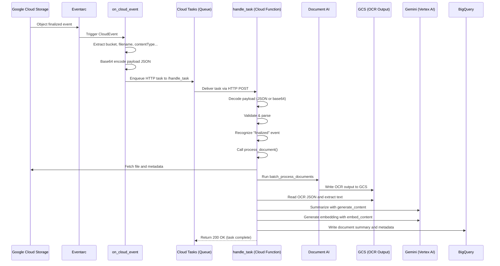

```mermaid
sequenceDiagram
    participant GCS as Google Cloud Storage
    participant Eventarc as Eventarc
    participant CEFunc as on_cloud_event
    participant Tasks as Cloud Tasks (Queue)
    participant HTFunc as handle_task (Cloud Function)
    participant DocAI as Document AI
    participant GCS2 as GCS (OCR Output)
    participant GenAI as Gemini (Vertex AI)
    participant BQ as BigQuery

    GCS->>Eventarc: Object finalized event
    Eventarc->>CEFunc: Trigger CloudEvent
    CEFunc->>CEFunc: Extract bucket, filename, contentType...
    CEFunc->>CEFunc: Base64 encode payload JSON
    CEFunc->>Tasks: Enqueue HTTP task to /handle_task

    Tasks->>HTFunc: Deliver task via HTTP POST
    HTFunc->>HTFunc: Decode payload (JSON or base64)
    HTFunc->>HTFunc: Validate & parse
    HTFunc->>HTFunc: Recognize "finalized" event
    HTFunc->>HTFunc: Call process_document()

    HTFunc->>GCS: Fetch file and metadata
    HTFunc->>DocAI: Run batch_process_documents
    DocAI->>GCS2: Write OCR output to GCS
    HTFunc->>GCS2: Read OCR JSON and extract text

    HTFunc->>GenAI: Summarize with generate_content
    HTFunc->>GenAI: Generate embedding with embed_content

    HTFunc->>BQ: Write document summary and metadata

    HTFunc-->>Tasks: Return 200 OK (task complete)
```